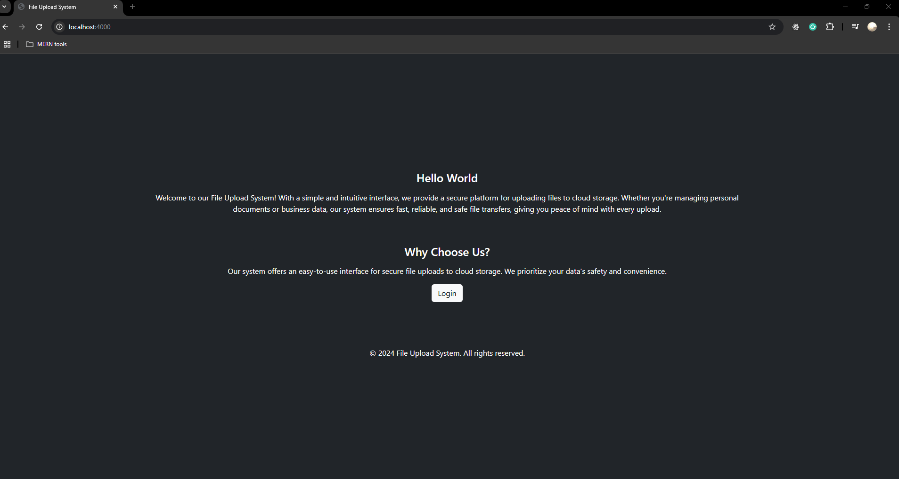
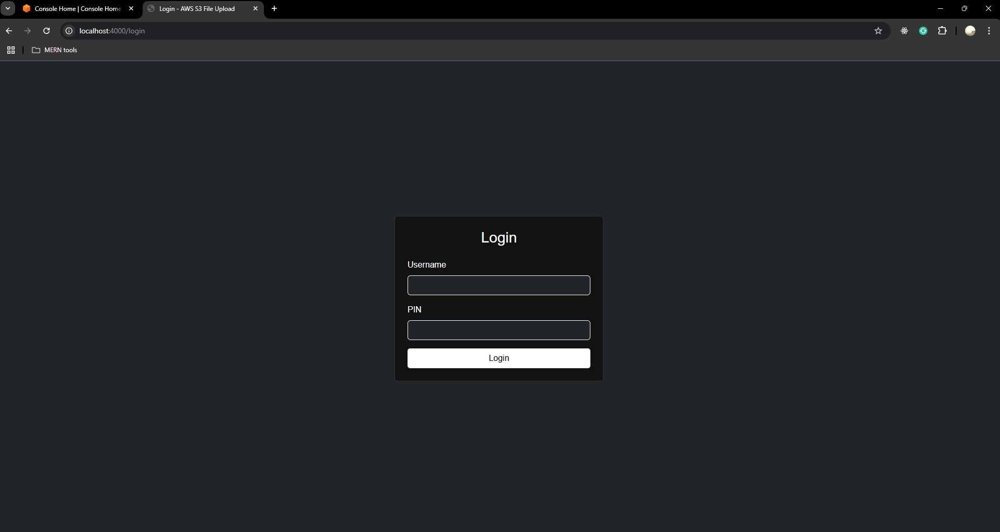
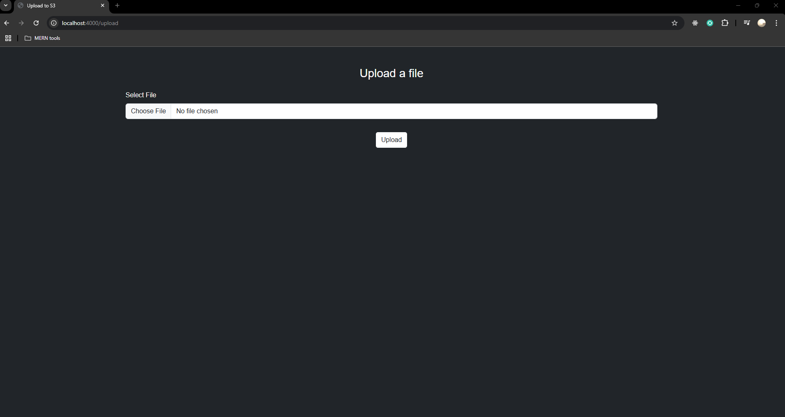

## AWS-S3

# CSD-4553-02
The code base of the course CSD-4553-02-Cloud Computing.

# AWS S3 File Upload System
This is a simple secure web application using NodeJS that allows users to upload files to an AWS
S3 bucket. This application have a feature like professional user interface, authentication,
and proper AWS integration.

## Features

### Manages following data:
- Homepage
- Login
- File upload
- Responsive

## Application Preview

Homepage

Login Page

Upload Page
<!-- 
AWS Page -->


## Setup
1. Clone the repository:
   ```
   git clone https://github.com/sushilthapaIT/AWS-S3
   cd "Project Folder"
   ```

2. Install Project Dependencies:
   ```
   npm install
   ```

3. Set up your AWS S3 profile and update the `.env` file with your access keys.

##### Set Up Instructions
To run the application, you have to create a ".env" file locally.
This file must include two variables called ```"AWS_ACCESS_KEY_ID"```, ```"AWS_SECRET_ACCESS_KEY"```, ```"AWS_REGION"```, ```"AWS_BUCKET_NAME"```which can be AWS credentials. 

4. Run the Application:
   ```
   npm start
   npm run dev
   ```

5. Access the Application
  Open your web browser and go to http://localhost:5000 (or the port you set in .env). You should see the home page of the application